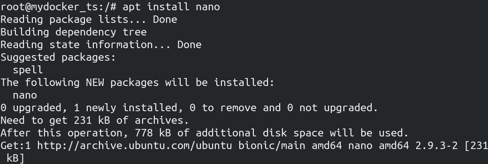

# 实现一个简单的 docker

## 0X00 仓库介绍

学习了耗叔的 docker 相关博客以后，被博客接地气详实的内容深深吸引，于是跟着博客的内容动手写了一个 `toy_docker`  

博客地址如下：

-  [Docker基础技术：DeviceMapper](https://coolshell.cn/articles/17200.html) 
-  [Docker基础技术：AUFS](https://coolshell.cn/articles/17061.html)
-  [Docker基础技术：Linux CGroup](https://coolshell.cn/articles/17049.html) 
-  [Docker基础技术：Linux Namespace（上）](https://coolshell.cn/articles/17010.html) 
-  [Docker基础技术：Linux Namespace（下）](https://coolshell.cn/articles/17029.html) 

但是，仅仅 copy 博客上的代码是不能实现我现在这个 toy_docker 的。  

实现这个 toy_docker 也有很多坑，但是代码量不大 200 行。  

最后希望我的代码能对大家理解耗叔文章有一些帮助。

## 0X01 目录结构

+ `articles` 记录了我写的博客，这些博客与耗叔的博客大致相同，仅仅为了自己学习与理解

+ `code` 记录了「中间代码」和「最终代码」以及完成这个 toy_docker 需要的类似系统镜像的「压缩包」

+ `images` 放了一些图片  

## 0X02 实现的功能

基本完成了一个 docker 虚拟机的功能：

+ `能上网，能安装程序`

+ `能通过 cgroup 限制 docker 的 cpu 的使用率`  

+ `完成 6 种 namespace 的隔离`

