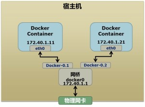

# docker 的基础技术(下)


> 看了「陈皓大佬」的***[文章](https://coolshell.cn/articles/17029.html)***，跟着「陈皓大佬」的文章，我们一起来实现一个 toy_docker。文章中的大部分内容来自「陈皓大佬」***[文章](https://coolshell.cn/articles/17029.html)***。我仅仅是为了学习与记忆，重新写了一遍。


继续上一篇「docker 的基础技术(上)」，还有两个 Namespace 的隔离还没有讲


## User Namespace


首先，我们只需在 `clone` 中加入这么一个 flag（CLONE_NEWUSER）：


```shell
➜  code git:(master) ✗ sudo ./docker2.out
Parent [31818] - start a container!
Container [    1] - inside the container!
sys: Operation not permitted
dev: Operation not permitted
mnt: No such file or directory
bash: groups: command not found
nobody@container:/$ ls
bin  etc   lib	  mnt  proc  run   sys	usr
dev  home  lib64  opt  root  sbin  tmp	var
nobody@container:/$ id
uid=65534(nobody) gid=65534(nogroup) groups=65534(nogroup)
```

但是这里的 uid 和 gid 都是不正确的。


要把容器中的 uid 和真实系统的 uid 给映射在一起，需要修改 **/proc/<pid>/uid_map** 和 **/proc/<pid>/gid_map** 这两个文件。这两个文件的格式为：


**ID-inside-ns ID-outside-ns length**


其中：


- 第一个字段ID-inside-ns表示在容器显示的UID或GID，
- 第二个字段ID-outside-ns表示容器外映射的真实的UID或GID。
- 第三个字段表示映射的范围，一般填1，表示一一对应。


比如，把真实的 uid = 1000 映射成容器内的 uid = 0：

```shell
0 1000 1
```


另外需要注意的是：


- 写这两个文件的进程需要这个 namespace 中的 CAP_SETUID (CAP_SETGID) 权限（可参看[Capabilities](http://man7.org/linux/man-pages/man7/capabilities.7.html)）

  

- 写入的进程必须是此 user namespace 的父或子的 user namespace 进程。

  

- 另外需要满如下条件之一：1）父进程将 effective uid/gid 映射到子进程的 user namespace 中，2）父进程如果有 CAP_SETUID/CAP_SETGID 权限，那么它将可以映射到父进程中的任一 uid/gid 。


例子就是这样（没有挂载）：


```c
#define _GNU_SOURCE
#include <stdio.h>
#include <stdlib.h>
#include <sys/types.h>
#include <sys/wait.h>
#include <sys/mount.h>
#include <sys/capability.h>
#include <stdio.h>
#include <sched.h>
#include <signal.h>
#include <unistd.h>

#define STACK_SIZE (1024 * 1024)

static char container_stack[STACK_SIZE];
char *const container_args[] = {
    "/bin/bash",
    NULL};

int pipefd[2];

void set_map(char *file, int inside_id, int outside_id, int len)
{
    FILE *mapfd = fopen(file, "w");
    if (NULL == mapfd)
    {
        perror("open file error");
        return;
    }
    fprintf(mapfd, "%d %d %d", inside_id, outside_id, len);
    fclose(mapfd);
}

void set_uid_map(pid_t pid, int inside_id, int outside_id, int len)
{
    char file[256];
    sprintf(file, "/proc/%d/uid_map", pid);
    set_map(file, inside_id, outside_id, len);
}

void set_gid_map(pid_t pid, int inside_id, int outside_id, int len)
{
    char file[256];
    sprintf(file, "/proc/%d/gid_map", pid);
    set_map(file, inside_id, outside_id, len);
}

int container_main(void *arg)
{

    printf("Container [%5d] - inside the container!\n", getpid());

    printf("Container: eUID = %ld;  eGID = %ld, UID=%ld, GID=%ld\n",
           (long)geteuid(), (long)getegid(), (long)getuid(), (long)getgid());

    /* 等待父进程通知后再往下执行（进程间的同步） */
    char ch;
    // 关闭写端
    close(pipefd[1]);
    // 父进程关闭写端的时候，子进程就不会阻塞了
    read(pipefd[0], &ch, 1);

    printf("Container [%5d] - setup hostname!\n", getpid());
    //set hostname
    sethostname("container", 10);

    //remount "/proc" to make sure the "top" and "ps" show container's information
    mount("proc", "/proc", "proc", 0, NULL);

    execv(container_args[0], container_args);
    printf("Something's wrong!\n");
    return 1;
}

int main()
{
    const int gid = getgid(), uid = getuid();

    printf("Parent: eUID = %ld;  eGID = %ld, UID=%ld, GID=%ld\n",
           (long)geteuid(), (long)getegid(), (long)getuid(), (long)getgid());

    pipe(pipefd);

    printf("Parent [%5d] - start a container!\n", getpid());

    int container_pid = clone(container_main, container_stack + STACK_SIZE,
                              CLONE_NEWUTS | CLONE_NEWPID | CLONE_NEWNS | CLONE_NEWUSER | SIGCHLD, NULL);

    printf("Parent [%5d] - Container [%5d]!\n", getpid(), container_pid);

    //To map the uid/gid,
    //   we need edit the /proc/PID/uid_map (or /proc/PID/gid_map) in parent
    //The file format is
    //   ID-inside-ns   ID-outside-ns   length
    //if no mapping,
    //   the uid will be taken from /proc/sys/kernel/overflowuid
    //   the gid will be taken from /proc/sys/kernel/overflowgid
    set_uid_map(container_pid, 0, uid, 1);
    set_gid_map(container_pid, 0, gid, 1);

    printf("Parent [%5d] - user/group mapping done!\n", getpid());

    /* 通知子进程 */
    close(pipefd[1]);

    waitpid(container_pid, NULL, 0);
    printf("Parent - container stopped!\n");
    return 0;
}
```


这样运行以后：


```shell
➜  code git:(master) ✗ sudo ./map_uid.out
Parent: eUID = 0;  eGID = 0, UID=0, GID=0
Parent [ 3490] - start a container!
Parent [ 3490] - Container [ 3491]!
Container [    1] - inside the container!
Parent [ 3490] - user/group mapping done!
Container: eUID = 0;  eGID = 0, UID=0, GID=0
read pipefd[0] Container [    1] - setup hostname!
root@container:~/Desktop/toy_docker/code# id
uid=0(root) gid=0(root) 组=0(root)
```


就完成了 User Namespace 的简单隔离！


## Network Namespace


最复杂的地方来了！


先叙述基本原理：





其实这张图也有一点点问题：就是不一定是物理网卡，只要是能够转发的网卡都行，不管是虚拟的还是真是存在的！


基本原理就是：**创建一个网桥，建立虚拟网卡与网桥之间联系！**


首先我们要学会 docker 网络的基本原理（通过 ip 命令实现）


```shell
## 首先，我们先增加一个网桥mydocker，模仿docker
brctl addbr mydocker
brctl stp mydocker off
ifconfig mydocker 192.168.10.1/24 up #为网桥设置 IP 地址
 
## 接下来，我们要创建一个network namespace - ns1

# 增加一个 namesapce 命令为 ns1 （使用ip netns add命令）
ip netns add ns1
 
# 激活 namespace 中的 loopback，即127.0.0.1（使用ip netns exec ns1来操作ns1中的命令）
ip netns exec ns1 ip link set dev lo up
## 然后，我们需要增加一对虚拟网卡
 
# 增加一个 pair 虚拟网卡，注意其中的veth类型，其中一个网卡要按进容器中
ip link add veth-ns1 type veth peer name out
 
# 把 veth-ns1 按到namespace ns1中，这样容器中就会有一个新的网卡了
ip link set veth-ns1 netns ns1
 
# 把容器里的 veth-ns1改名为 eth0 （容器外会冲突，容器内就不会了）
ip netns exec ns1 ip link set dev veth-ns1 name eth0 

# 为容器中的网卡分配一个IP地址，并激活它
ip netns exec ns1 ifconfig eth0 192.168.10.11/24 up

# 上面我们把veth-ns1这个网卡按到了容器中，然后我们要把out添加上网桥上
brctl addif mydocker out

# 为容器增加一个路由规则，让容器可以访问外面的网络
ip netns exec ns1 ip route add default via 192.168.10.1
```


接下来我们尝试为自己的容器添加虚拟网卡，经过 clone 出来的 network namespace 的名字是 **子进程的 pid**


